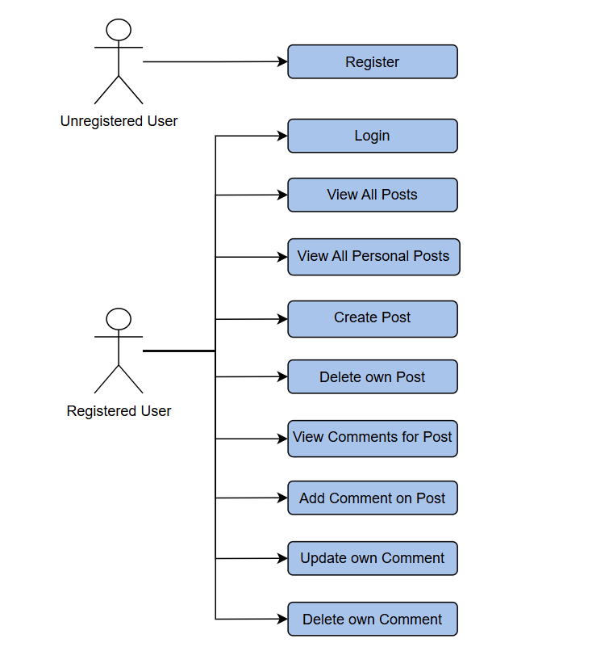
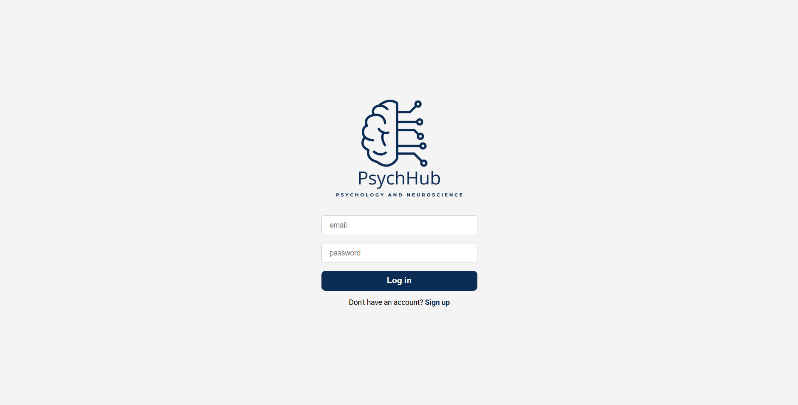
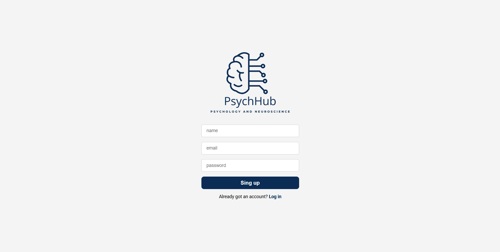
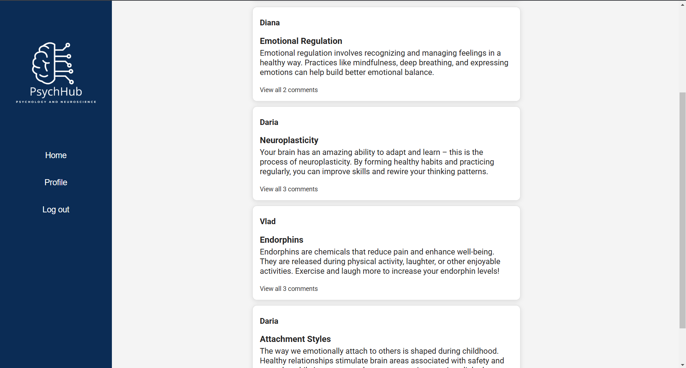
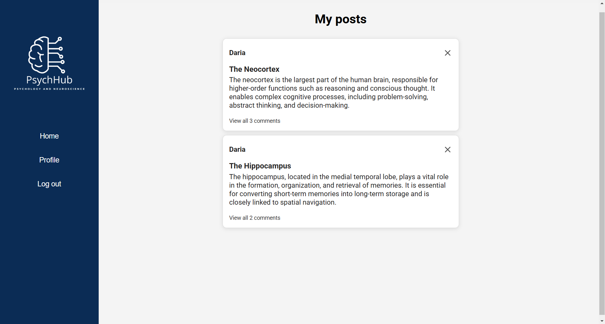
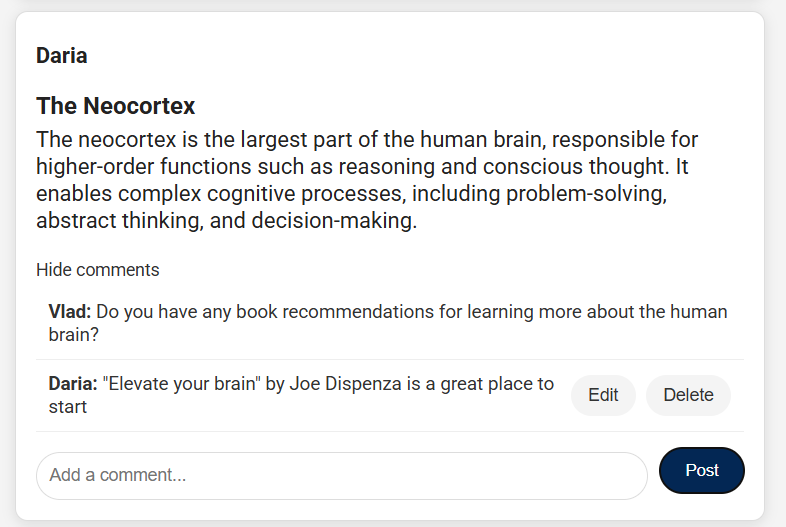
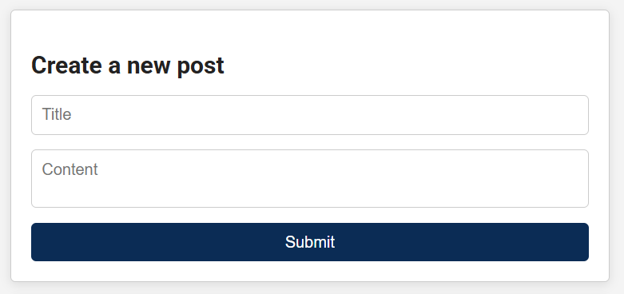

# PsychHub
PsychHub is a web application designed for psychology and neuroscience enthusiasts. The platform allows users to create accounts, share knowledge, and engage in discussions about mental health, neuroscience, and related fields. Whether you’re a researcher, a therapist, or simply curious about the human mind, PsychHub offers a welcoming space for sharing and exploring ideas.

## Used Technologies
**Backend**: Spring Boot  
**Frontend**: React  
**Database**: MySQL  

## Key features
- **Registration**: New users can register by providing their details.
- **Login**: Secure login functionality with username and password validation.
- **Create Posts**: Share your knowledge with the community by creating posts.
- **Delete Posts**: Remove posts from your profile.
- **Add Comments**: Engage with content by commenting on posts.
- **Edit Comments**: Update personal comments.
- **Delete Comments**: Remove personal comments if needed.
- **Feed Page**: Explore all posts shared by other users.
- **Profile Page**: Access and manage your own posts in a dedicated section.  

### Use Case Diagram

## Application Views
### Log in View

### Sign up View

### Home Page View

### Profile Page View

### Comment Section View

### Create Post View

## Future work
Here are some planned features for the platform:
- **Post Reactions**: Allow users to like posts.
- **Follow Functionality**: Enable users to follow other users, creating a personalized feed with posts only from the accounts they follow. 
- **Search Bar for Users**: Add a search functionality that allows users to find other users by their username.
- **Notifications**: Notify users when someone comments on their posts or follows them.
- **User Profile Customization**: Add profile pictures and personal bios.
